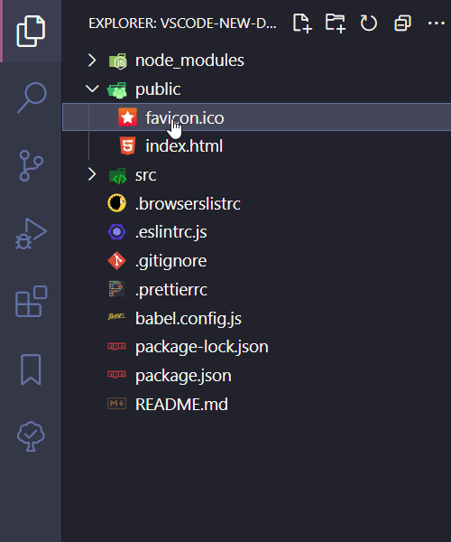

# New File / Folder

> Create file or folder from file's context menu

[✨ Install Via Marketplace ✨](https://marketplace.visualstudio.com/items?itemName=wenfangdu.faster-new)

By default, VSCode doesn't have the `New File` / `New Folder` option for file's context menu, this extension provides them for you.

